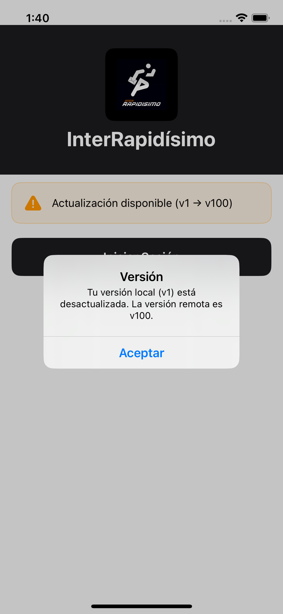

# InterRapidisimo App iOS

Prueba técnica para **InterRapidísimo** — aplicación nativa iOS desarrollada en **Swift 5.9+** con **SwiftUI** y target mínimo **iOS 17**.

La app replica la funcionalidad de la versión Android existente, incluyendo autenticación, verificación de versión, sincronización de tablas y consulta de localidades.

---

## Screenshots

<p align="center">
  
  
  
  
  
</p>

| Pantalla | Descripción |
|---|---|
| **Login** | Verificación de versión remota, tarjeta de estado y botón "Iniciar Sesión" |
| **Versión** | Alerta informando si la versión local está desactualizada |
| **Home** | Información del usuario autenticado con navegación a Tablas y Localidades |
| **Tablas** | Listado de esquemas sincronizados desde la API con PK y cantidad de campos |
| **Localidades** | Listado de localidades de recogida con abreviación de ciudad |

---

## Arquitectura

El proyecto sigue **Clean Architecture** con tres capas bien definidas y el patrón **MVVM** en la capa de presentación.

```
┌─────────────────────────────────────────────┐
│              Presentation (UI)              │
│         SwiftUI Views + ViewModels          │
│              (@Observable)                  │
├─────────────────────────────────────────────┤
│              Domain (Negocio)               │
│     Models · Use Cases · Repository I/F     │
├─────────────────────────────────────────────┤
│              Data (Implementación)          │
│   API Client · DTOs · SwiftData · Repos     │
└─────────────────────────────────────────────┘
```

### Capas

**Domain** — Capa central sin dependencias externas.
- `Model/` — Entidades de dominio (`User`, `Table`, `Locality`, `VersionStatus`, `DomainError`)
- `Repository/` — Protocolos (contratos) que definen el acceso a datos
- `UseCase/` — Casos de uso que encapsulan la lógica de negocio

**Data** — Implementación concreta de los repositorios.
- `Remote/` — `InterAPIClient` (URLSession + async/await), DTOs (Codable), `HttpErrorMapper`
- `Local/` — Entidades SwiftData (`UserEntity`, `TableEntity`)
- `Repository/` — Implementaciones que combinan datos remotos y locales

**Presentation** — Interfaz de usuario.
- `Login/` — Pantalla de login con verificación de versión
- `Home/` — Pantalla principal con información del usuario
- `Tables/` — Sincronización y listado de tablas
- `Localities/` — Listado de localidades de recogida
- `Common/` — Componentes reutilizables, extensiones de color y errores

---

## Estructura del proyecto

```
InterRapidisimo App iOS/
├── AppConfig.swift
├── InterRapidisimo_App_iOSApp.swift
├── ContentView.swift
│
├── Domain/
│   ├── Model/
│   │   ├── DomainError.swift
│   │   ├── User.swift
│   │   ├── Table.swift
│   │   ├── Locality.swift
│   │   └── VersionStatus.swift
│   ├── Repository/
│   │   ├── AuthRepository.swift
│   │   ├── VersionRepository.swift
│   │   ├── TableRepository.swift
│   │   └── LocalityRepository.swift
│   └── UseCase/
│       ├── CheckVersionUseCase.swift
│       ├── LoginUseCase.swift
│       ├── GetStoredUserUseCase.swift
│       ├── SyncTablesUseCase.swift
│       ├── GetTablesUseCase.swift
│       └── GetLocalitiesUseCase.swift
│
├── Data/
│   ├── Remote/
│   │   ├── InterAPIClient.swift
│   │   ├── DTO/
│   │   │   ├── AuthRequestDTO.swift
│   │   │   ├── AuthResponseDTO.swift
│   │   │   ├── TableSchemeDTO.swift
│   │   │   └── LocalityDTO.swift
│   │   └── Mapper/
│   │       └── HttpErrorMapper.swift
│   ├── Local/
│   │   └── Model/
│   │       ├── UserEntity.swift
│   │       └── TableEntity.swift
│   └── Repository/
│       ├── AuthRepositoryImpl.swift
│       ├── VersionRepositoryImpl.swift
│       ├── TableRepositoryImpl.swift
│       └── LocalityRepositoryImpl.swift
│
├── Presentation/
│   ├── Common/
│   │   ├── Color+App.swift
│   │   ├── DomainError+UIMessage.swift
│   │   ├── LoadingOverlay.swift
│   │   └── ErrorMessageView.swift
│   ├── Login/
│   │   ├── LoginViewModel.swift
│   │   └── LoginScreen.swift
│   ├── Home/
│   │   ├── HomeViewModel.swift
│   │   └── HomeScreen.swift
│   ├── Tables/
│   │   ├── TablasViewModel.swift
│   │   └── TablasScreen.swift
│   └── Localities/
│       ├── LocalitiesViewModel.swift
│       └── LocalidadesScreen.swift
│
└── DI/
    └── DependencyContainer.swift
```

---

## Patrones y decisiones técnicas

| Aspecto | Decisión |
|---|---|
| **Arquitectura** | Clean Architecture (Domain / Data / Presentation) |
| **Patrón de UI** | MVVM con `@Observable` (iOS 17) |
| **Networking** | `URLSession` + `async/await` — sin dependencias externas |
| **Persistencia local** | SwiftData (`@Model`, `ModelContainer`, `ModelContext`) |
| **Manejo de errores** | `Result<T, DomainError>` en todas las capas — nunca `throws` para lógica de negocio |
| **Inyección de dependencias** | `DependencyContainer` manual (singleton) |
| **Navegación** | `NavigationStack` + `NavigationPath` con enum `AppRoute` |
| **Concurrencia** | `async/await` nativo de Swift — sin Combine |
| **UI strings** | En español |
| **Identificadores de código** | En inglés |

---

## Flujo de la aplicación

1. **Launch** → Se muestra `LoginScreen`
2. **Inicialización** → Se ejecutan en paralelo: verificación de versión remota + búsqueda de usuario almacenado (SwiftData)
3. Si hay usuario almacenado → navegación directa a `HomeScreen`
4. Si no hay usuario → se muestra tarjeta de estado de versión + botón "Iniciar Sesión"
5. **Login** → Se envían credenciales via headers HTTP → se guarda el usuario en SwiftData → navegación a `HomeScreen`
6. **Home** → Muestra datos del usuario + dos botones de navegación
7. **Tablas** → Sincroniza esquemas desde la API → persiste en SwiftData → muestra listado
8. **Localidades** → Consulta localidades de recogida desde la API → muestra listado (sin persistencia local)

---

## Requisitos

- Xcode 15+
- iOS 17.0+
- Swift 5.9+

---

## Autor

Kenny — Prueba técnica iOS para InterRapidísimo
